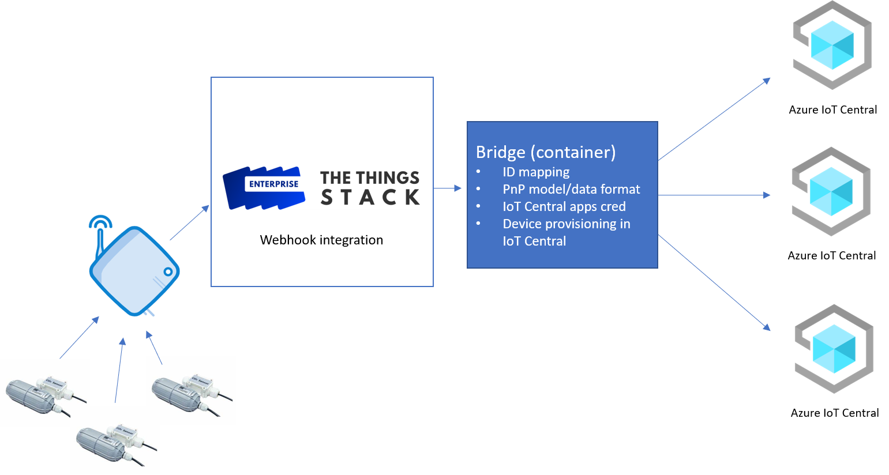
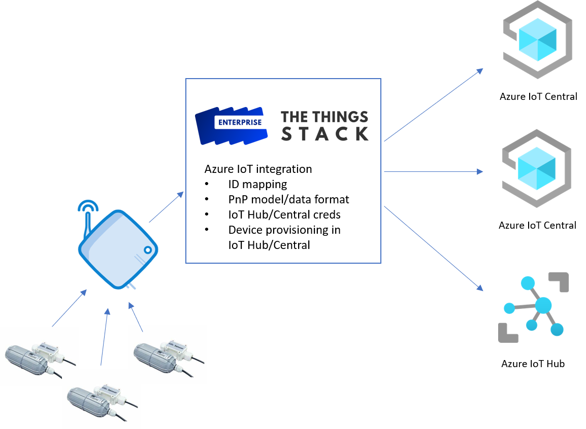
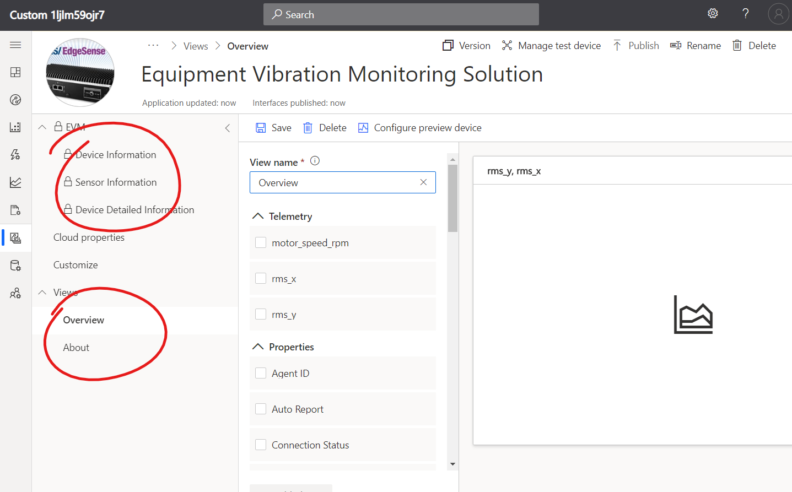
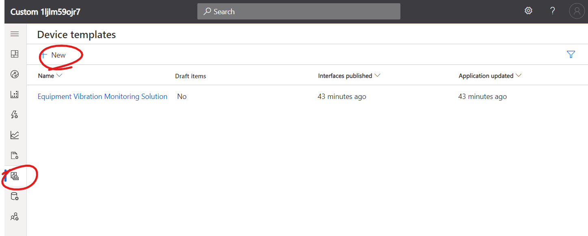
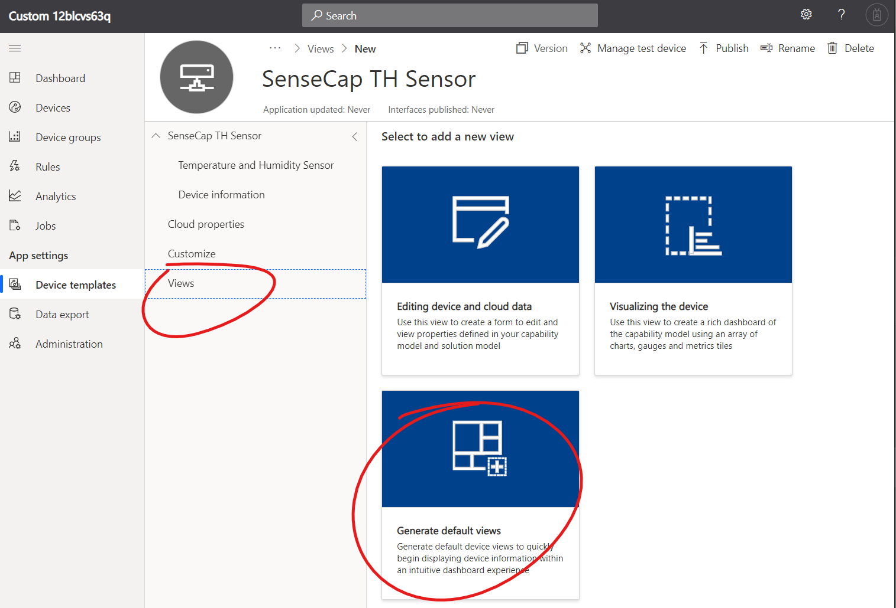
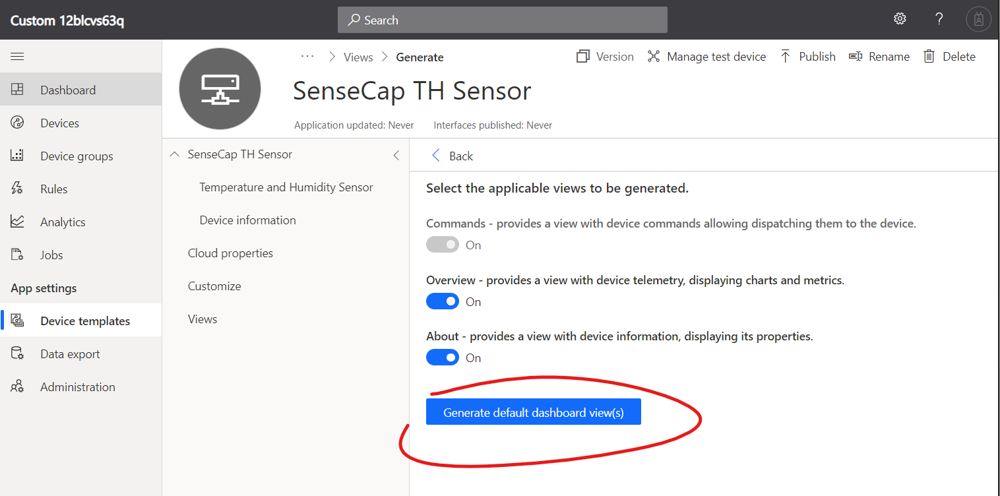
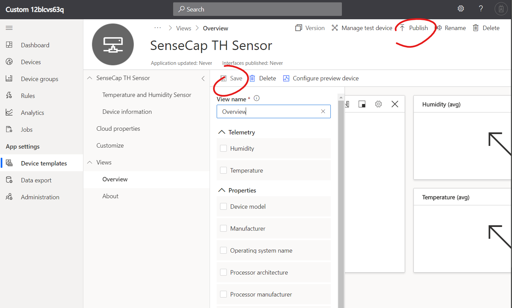

# Welcome to The Things Conference Microsoft's workshop <!-- omit in toc -->

Thanks for joining this short workshop.
In the next hour or so, you will be introduced to [Azure IoT Central](https://azure.microsoft.com/services/iot-central/) and [IoT Plug and Play](https://docs.microsoft.com/azure/iot-pnp/overview-iot-plug-and-play), letting you discover how simple IoT can be.
The integration with The Things Network and the onboarding of LoRa devices on IoT Plug and Play is in its very early stages, and you should expect the experience in integrating The Things Network with Azure IoT to dramatically improve in the coming months. But we couldn't wait to offer you a little taste of what it will become soon.

## Introduction <!-- omit in toc -->

### Prerequisites <!-- omit in toc -->

To go through this workshop, you will need your laptop and a Web browser… that's it!

We will provide a [Seeed Studio SenseCap Temperature and Humidity sensor](https://www.seeedstudio.com/catalogsearch/result/?q=SenseCAP+Air+Temperature) for you to see real data flowing in.
Note that we have taken care of the provisioning of this sensor on The Things Network as well as the setup of the integration through a WebHook to IoT Central. These parts are the ones that will change in the near future, and we want you to focus on the experience with the Cloud stuff!

### Wondering what Azure IoT Central is about? <!-- omit in toc -->

Check out the video below that explains what IoT Central is for. Skip if you are eager to get to the hands-on!

### How is that working <!-- omit in toc -->

Here are a couple of simple diagrams explaining how things are working today and what we expect to be able to offer within The Things Network in the future.

#### Current architecture <!-- omit in toc -->

#### Future architecture <!-- omit in toc -->

## Hands-on time!

In the following steps you will:

- [Hands-on time!](#hands-on-time)
- [Create your very own (and free) Azure IoT Central application](#create-your-very-own-and-free-azure-iot-central-application)
- [Add an IoT Plug and Play Certified device to the application](#add-an-iot-plug-and-play-certified-device-to-the-application)
- [Import an IoT Plug and Play model for your LoRa sensor](#import-an-iot-plug-and-play-model-for-your-lora-sensor)
- [Bridge TTN to Azure IoT Central and connect the LoRaWAN SenseCap TH Sensor to your application](#bridge-ttn-to-azure-iot-central-and-connect-the-lorawan-sensecap-th-sensor-to-your-application)
- [Additional challenge](#additional-challenge)

## Create your very own (and free) Azure IoT Central application

Azure IoT Central comes with a free 7-day trial that doesn't require an Azure subscription. If you have an Azure subscription, pay attention to step #4 below.

1. Visit [https://apps.azureiotcentral.com](https://apps.azureiotcentral.com) and click on the "Build" button in the left menu.

    

1. You are invited to select an industry and app template or to create a new custom app. At this point, you can navigate through the various industries and templates to see what's available. These templates offer a starting point that implements actual common scenarios in these vertical industries.
\
For this workshop, we want you to experience how to build your very own app from scratch. Feel free to come back later and experience some pre-configured templates.
\
On the next screen, select "Custom Apps."

    > [!NOTE]
    > Note that you can only have one free trial application, so if you want to create a second application or have your application persist, you will have to use an Azure Subscription (which you can create for free visiting [https://aka.ms/aft-iot](https://aka.ms/aft-iot))

    

1. Sign in with a Microsoft Account (you can create one if you don't have one already, it's a pretty straight forward process). The sign-in is required so you can easily find your applications in the future. At this point, you can only use a Microsoft account.
If you have an Azure subscription you want to deploy your app into, use the email registered with this subscription.

    

1. Fill in the various fields and remember to select "7-day free trial" if you don't have an Azure subscription. If you have a subscription you want to use, enter the corresponding Directory and Subscription.

    > [!NOTE]
    > The name of your application has to be unique. The recommendation is to use your name (or your cat's name if you have one) as a prefix. Or just make something up that is unique to you!

     

    > [!NOTE]
    > The personal information you are asked to fill in is only to verify you are a human. As per the privacy statement linked to from the page and as indicated above the "Create" button, it's an opt-in if you want Microsoft to contact you later.

1. Once all fields are filled, click on "Create" and let the magic happen.

    

Feel free to navigate your application to discover the different pages. You can also watch this short video below that will walk you through the app.

## Add an IoT Plug and Play Certified device to the application

IoT Plug and Play is a feature Azure IoT developed on top of the [Digital Twins Definition Model](https://github.com/Azure/IoTPlugandPlay/tree/master/DTDL).
You can learn what IoT PnP is by watching [this video](https://youtu.be/rzTw1_AuxdQ) (11min long) and/or reading this [introductory documentation page](https://docs.microsoft.com/azure/iot-pnp/overview-iot-plug-and-play).

DTDL is certainly the most interesting part of IoT Plug and Play as it is the backbone that makes it possible for a device manufacturer to publish his devices' capability models to a public (or private) repository, and for a cloud application developer to easily integrate these devices and their data into their apps.
Let's see how this works.

1. Go to the Device Templates page clicking in the menu or on the tile.

    

1. Let's pick a Plug and Play device from the catalog (here I am selecting the **Equipment Vibration Monitoring Solution**, but you can check out other devices as well). All the devices listed below have been going through the Azure IoT certification program. It allows our partners to showcase their devices in a broad catalog our customers like to pick devices from, with the assurance that they will seamlessly connect to their Azure IoT based solutions.

    Once you have selected the template, click on "Next: Customize" then on "Create."

    

    This new device template will be added to your application. You can see the capabilities the device exposes as well as the Views that have been pre-configured as part of the device model:

    

1. We don't have this device, so we can't test how things are looking with a real device, but the fact that this is an IoT Plug and Play device allows IoT Central to simulate a device of that type. Let's go ahead a create a simulator.

1. Select the Devices page in the left menu.

1. Select the **Equipment Vibration Monitoring Solution** device Type.

1. Click on "New."

1. Toggle "Simulated" to On.

1. Click on "Create."

    

1. You just created a new simulator of type **Equipment Vibration Monitoring Solution**. Select it in the devices clicking on its name to bring up its dashboard. After a few seconds, the simulator will kick in, and the dashboard will start displaying telemetry. Not a single line of code and IoT Central was able to understand what the device is saying.

    

## Import an IoT Plug and Play model for your LoRa sensor

Now that we have seen how importing an actual Plug and Play device that has already been published in the catalog, let's take a look at how you can import the model of a device that is not published up there. As a matter of fact, the SenseCap TH Sensor you have is not certified for IoT Plug and Play, but that won't prevent us from taking advantage of Plug and Play.
Let's create a Device Capability Model file in the DTDL format real quick and then import it in our IoT Central application.

As a device manufacturer, the process would consist in creating a Device Model using the DTDL format, then publish this model to your company repository. After going through the certification process, your device model would then publicly appear in the IoT Central catalog. If you want to learn more about all these steps, check out our [documentation](https://docs.microsoft.com/azure/iot-pnp/tutorial-pnp-visual-studio-code). For the sake of the workshop, let's just manually import a model.

1. Download the following file: **[SenseCapTHSensorModel.json](https://raw.githubusercontent.com/olivierbloch/MSFTTheThingsConferenceWorkshop/master/SenseCapTHSensorModel.json)**.

1. In the IoT Central application, go to the Devices Templates page and click on "New."

    

1. Select "IoT Device" then "Next: Customize."

    

1. Click on "Next: Review" then on "Create."

1. Enter the device template name **SenseCap TH Sensor** and hit Enter.

1. On the next screen, select "Import capability model."

    

1. Select the JSON file you just downloaded. A new model has now been imported into your application. Let's now create a view!

    > [!NOTE]
    > The views cannot be added to a Plug and Play Device Capability Model as these are specific to IoT Central. When certifying and publishing a PnP device to the public repository, you have the option to add views to what is called the Device Solution Model.

    

1. Go to the Views page and click on "Generate default views."

    

1. Then click on "Generate default dashboard(s) view."

    

1. You can verify that the view is as you like, adapt tiles sizes, style, and position to adapt the dashboard to your user's needs. You'll notice that the default overview dashboard has one of the tiles a bit off, that's a known bug of the preview :-). Once you are done customizing your view for the TH Sensor, click on "Save" then "Publish" to validate the device model version (device models can be edited and will automatically be versioned when you make changes and republish a revised model to the app).

    

## Bridge TTN to Azure IoT Central and connect the LoRaWAN SenseCap TH Sensor to your application

As indicated earlier, we are using the open-source IoT Central device bridge. In order to configure the bridge to forward telemetry from The Things Network to your Azure IoT Central application, we have already setup our TTN tenant to format the payload and setup a WebHook integration to trigger the bridge. For the bridge to be authorized to connect to your application to provision the device and send telemetry, we need your application's credentials.

1. In your IoT Central application, go to the "Administration" page and select "Device Connection."

    

1. Take note of the ID scope, then click on "View Keys" below and copy the primary key.

    

1. Take note of your SenseCap TH Sensor EUI.

    

1. Post the three onto the [workshop Slack channel](https://aka.ms/MSFTWorkshop/Slack) (you might need to join the )

   * Device EUI
   * App ID Scope
   * App primary key

1. Once we setup the bridge to connect to your application, it will provision a new device with the same ID as the EUI in TTN. Furthermore, thanks to Plug and Play, the device will share with the application what device model to use. This way the application will know to associate this new device to the model you just uploaded in the application importing the JSON file. Then it will start sending telemetry respecting the format defined by the Device Capability Model.

Congratulations, you have successfully connected your LoRaWAN device to Azure IoT Central.

## Additional challenge

If you reached this point in the workshop and have some time to spare, we invite you to navigate in the IoT Central application and find by yourself how you can setup an alert and send a message each time the temperature (or humidity) passes a certain threshold. Then blow on the sensor to trigger the alert!
